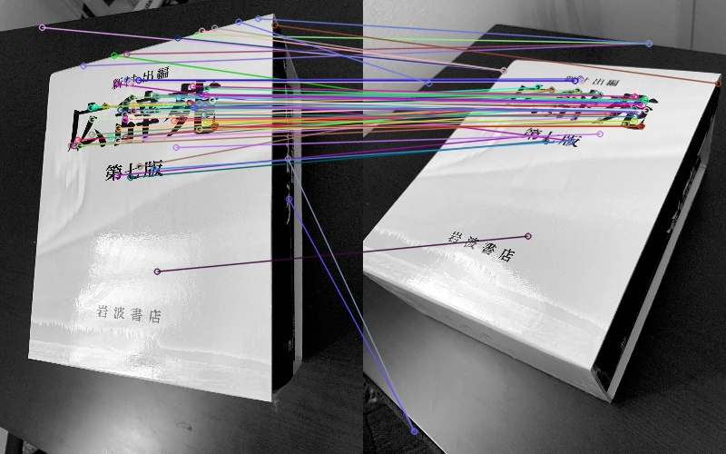

# SIFT

This is an implementation of SIFT (Scale-invariant feature transform).



### Usage
First, install libraries.
```bash
$ pipenv install -d
```

Type this to run SIFT.
```bash
$ python main.py
```

### References
- [opencv library](https://github.com/opencv/opencv/)
- article about SIFT [Implementaing SIFT in Python, Russ Islam](https://medium.com/@russmislam/implementing-sift-in-python-a-complete-guide-part-1-306a99b50aa5)
- original paper ["Distinctive Image Features from Scale-Invariant Keypointsa", David G.Lowe](https://www.cs.ubc.ca/~lowe/papers/ijcv04.pdf)